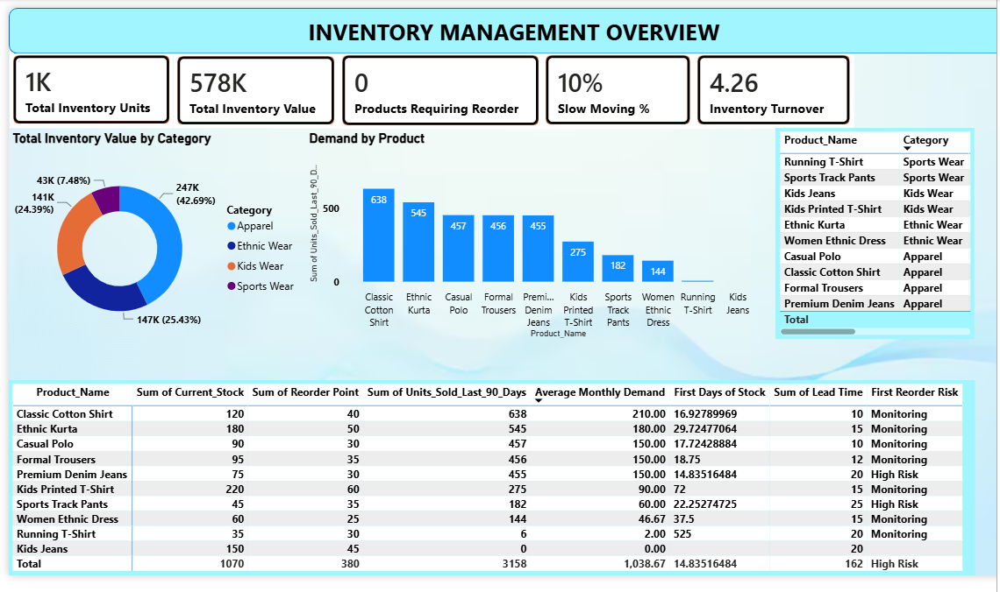

Inventory Management & Replenishment Analysis

📌 Project Overview

An end-to-end Business Analysis project focused on improving inventory monitoring, replenishment decisions, demand analysis, and identification of slow-moving inventory.

The project demonstrates the complete Business Analyst lifecycle from business problem identification and requirements analysis to data analysis, Power BI reporting, and business recommendations.

---

🎯 Business Problem

The organization was facing several inventory-management challenges:

- Reorder decisions were based largely on assumptions.
- Inventory reports were prepared manually.
- Reorder decisions could happen too late.
- Management did not have timely inventory information.
- Slow-moving products were not being identified effectively.
- Production teams needed timely information when replenishment was required.

The objective was to develop a data-driven approach for monitoring inventory and supporting better replenishment decisions.

---

👥 Stakeholders

- Senior Management
- Inventory Management Team
- Production Team
- Sales Team
- Finance Team
- Wholesale & Retail Teams

---

🔍 Business Analysis Approach

The project followed an end-to-end BA approach:

1. Business Problem Identification
2. Stakeholder Identification
3. Requirement Gathering
4. Requirement Prioritization
5. User Stories
6. Acceptance Criteria
7. Requirements Traceability Matrix (RTM)
8. User Acceptance Testing (UAT)
9. Data Cleaning & Analysis
10. KPI Development
11. Power BI Dashboard Development
12. Business Insights & Recommendations

---

📋 Key Business Requirements

Must Have

- Provide timely inventory and reorder information.
- Monitor current inventory against defined reorder points.
- Provide timely notifications when replenishment is required.

Should Have

- Improve reorder-point decisions using historical demand.
- Identify slow-moving products.
- Provide inventory reports based on current stock.

Could Have

- Introduce demand forecasting.
- Track historical reorder-point changes.
- Compare previous and revised reorder points to evaluate decision quality.

---

📊 Key KPIs

KPI| Result
Total Inventory Units| 1,070
Inventory Value| ₹5,78,000
Products Requiring Reorder| 0
Stockout Rate| 0%
Slow-Moving Inventory| 10%
Average Inventory Value| ₹6,14,000
Total COGS| ₹26,12,800
Inventory Turnover| 4.26×

---

📈 Key Analysis

Demand Analysis

Historical sales were analyzed to understand product-level demand and identify products requiring closer monitoring.

Reorder Risk

Days of stock were compared with replenishment lead time to identify potential stockout risks.

High-risk products identified:

- Premium Denim Jeans
- Sports Track Pants

Slow-Moving Inventory

A product with no sales during the previous 90 days was considered slow-moving.

Key finding:

Kids Jeans

- Current stock: 150 units
- Sales in last 90 days: 0
- Inventory value: ₹75,000

High-Demand Product

Classic Cotton Shirt

- 90-day sales: 638 units
- Approximately 17 days of stock coverage

This product should be monitored closely because of its relatively high demand.

---

💡 Key Business Recommendations

1. Review reorder points using historical demand and replenishment lead time.
2. Monitor high-risk products before stock coverage falls below lead time.
3. Investigate slow-moving inventory to reduce excess stock and tied-up working capital.
4. Replace assumption-based replenishment decisions with data-driven analysis.
5. Reduce dependency on manually prepared inventory reports.
6. Implement timely inventory alerts for replenishment requirements.
7. Track changes to reorder points and evaluate whether revised decisions improve inventory performance.

---

📊 Power BI Dashboard

The Power BI dashboard provides management with:

- Inventory KPI cards
- Inventory value by category
- Product demand analysis
- Reorder risk analysis
- Days of stock
- Slow-moving product analysis
- Business insights and recommendations

Dashboard Preview

## Dashboard Preview

---

🛠️ Tools & Technologies

- Microsoft Excel
- Power Query
- Power BI
- DAX
- Data Analysis
- Data Visualization

---

📁 Project Deliverables

- Business Problem Analysis
- Stakeholder Analysis
- Requirements
- User Stories
- Acceptance Criteria
- Requirements Traceability Matrix
- UAT Scenarios
- Excel Analysis
- KPI Calculations
- Power BI Dashboard
- Business Recommendations
- Project Documentation

---

🎓 BA Skills Demonstrated

- Requirements Gathering & Elicitation
- Stakeholder Analysis
- Requirement Prioritization
- User Stories
- Acceptance Criteria
- RTM
- UAT
- Process Analysis
- Gap Analysis
- KPI Development
- Data Analysis
- Business Insights
- Data-Driven Decision Making
- Power BI & DAX

---

📌 Project Outcome

The project transformed an inventory-management problem into a structured, data-driven decision-support solution.

The analysis helped identify potential stockout risks, slow-moving inventory, high-demand products, inventory concentration, and replenishment priorities, while the Power BI dashboard provided management with a centralized view of inventory performance.

---

👤 Author

Mayur Patil

BBA Finance | Aspiring Business Analyst

Skills: Business Analysis | Excel | Power BI | DAX | SQL | Tableau
